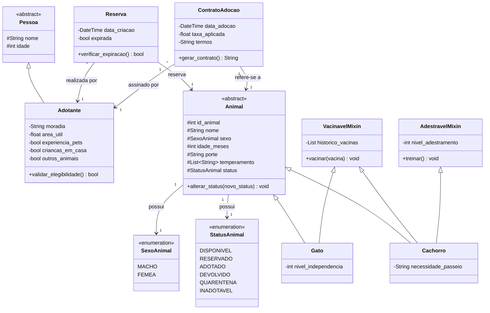

 # Diagrama de Classes UML - Sistema de Adoção de Animais

```mermaid

classDiagram
    class StatusAnimal {
        <<enumeration>>
        DISPONIVEL
        RESERVADO
        ADOTADO
        DEVOLVIDO
        QUARENTENA
        INADOTAVEL
    }

    class SexoAnimal {
        <<enumeration>>
        MACHO
        FEMEA
    }

    class Pessoa {
        <<abstract>>
        #String nome
        #int idade
    }

    class Adotante {
        -String moradia
        -float area_util
        -bool experiencia_pets
        -bool criancas_em_casa
        -bool outros_animais
        +validar_elegibilidade() bool
    }

    class Animal {
        <<abstract>>
        #int id_animal
        #String nome
        #SexoAnimal sexo
        #int idade_meses
        #String porte
        #List~String~ temperamento
        #StatusAnimal status
        +alterar_status(novo_status) void
    }

    class VacinavelMixin {
        -List historico_vacinas
        +vacinar(vacina) void
    }

    class AdestravelMixin {
        -int nivel_adestramento
        +treinar() void
    }

    class Cachorro {
        -String necessidade_passeio
    }

    class Gato {
        -int nivel_independencia
    }

    class Reserva {
        -DateTime data_criacao
        -bool expirada
        +verificar_expiracao() bool
    }

    class ContratoAdocao {
        -DateTime data_adocao
        -float taxa_aplicada
        -String termos
        +gerar_contrato() String
    }

    %% Heranças
    Pessoa <|-- Adotante
    Animal <|-- Cachorro
    Animal <|-- Gato

    %% Mixins (Herança Múltipla)
    VacinavelMixin <|-- Cachorro
    AdestravelMixin <|-- Cachorro
    VacinavelMixin <|-- Gato

    %% Relacionamentos e Associações
    Animal "1" --> "1" StatusAnimal : possui
    Animal "1" --> "1" SexoAnimal : possui
    Reserva "*" --> "1" Adotante : realizada por
    Reserva "1" --> "1" Animal : reserva
    ContratoAdocao "*" --> "1" Adotante : assinado por
    ContratoAdocao "1" --> "1" Animal : refere-se a
    
```
